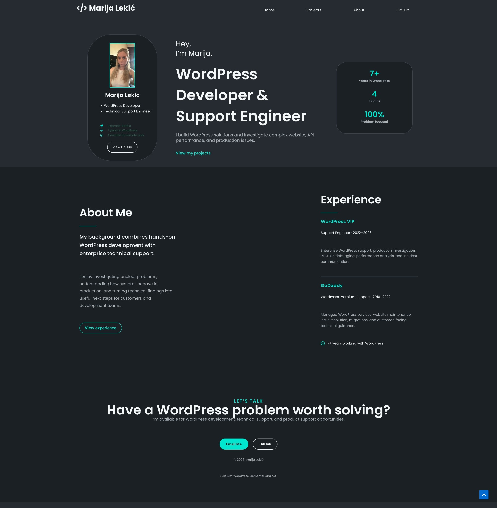

# WordPress Elementor Portfolio

A responsive developer portfolio built with WordPress, Elementor Pro, and the Astra theme. The design is adapted from a dark developer-portfolio concept in Figma and customized around real WordPress development and technical support experience.



## Highlights

- Responsive single-page portfolio
- Custom Elementor layout built with Flexbox and Grid containers
- WordPress navigation with anchor links and a mobile dropdown
- Hero profile, professional summary, experience, and contact sections
- Reusable global colors and typography
- Importable Elementor page template

## Technology

- WordPress
- Elementor Pro
- Astra
- Advanced Custom Fields installed for future dynamic project content
- Poppins typography
- Responsive Flexbox and CSS Grid layouts

## Repository contents

```text
elementor-template/
  marija-elementor-portfolio.json
screenshots/
  homepage-desktop.jpeg
docs/
  setup.md
```

## Import

See [docs/setup.md](docs/setup.md) for requirements and import instructions.

## Design direction

The visual direction is based on the SinanTokmak developer portfolio template by Johann Leon:

- Figma Community: https://www.figma.com/community/file/1308624569713896610
- Original design presentation: https://dribbble.com/shots/22850159-SinanTokmak-Web-Developer-Portfolio-Website-Design

The implementation and portfolio content are customized for this project.

## Current scope

This repository contains the homepage template shown in the screenshot. Dynamic ACF project entries and individual case-study templates are planned as a future enhancement and are not included in this version.

## Author

**Marija Lekić**

- GitHub: https://github.com/lolifoks

## License

Code and original implementation documentation are provided under the MIT License. Third-party design inspiration and software retain their respective licenses.
